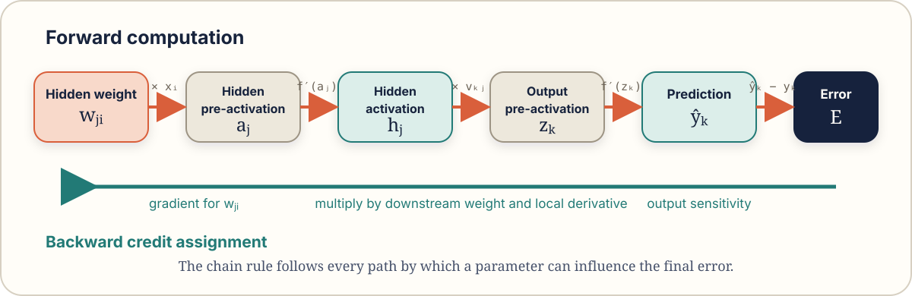

# Learning Representations by Back-Propagating Errors

## Citation

David E. Rumelhart, Geoffrey E. Hinton and Ronald J. Williams. “Learning representations by back-propagating errors.” *Nature* 323, 533–536, 1986.

- Publisher: https://doi.org/10.1038/323533a0
- Published: 9 October 1986

## One-sentence contribution

A multilayer network can learn useful internal features by propagating output error backward through differentiable layers and adjusting each weight according to its contribution to that error.

## Why this paper belongs in a representation project

The paper is often introduced as “the backpropagation paper”, but its title emphasises the deeper point: **hidden units learn representations**. The output layer does not have to solve the task directly in the original input coordinates. Earlier layers can reshape the input into a space where the desired output is easier to compute.

## Historical context

A single-layer perceptron can learn a linear decision boundary. It cannot solve tasks requiring a nonlinear boundary in the supplied feature space, such as XOR. A human could manually construct a new feature, but the paper demonstrates a general procedure for training intermediate units to discover useful features from error signals.

The paper did not invent every mathematical ingredient of reverse-mode differentiation, and related ideas existed earlier. Its historical importance comes from clearly demonstrating practical learning of internal representations in multilayer connectionist networks and making the idea influential.

## The problem before the paper

Suppose a network receives \(x_1\) and \(x_2\) and must compute XOR.

| \(x_1\) | \(x_2\) | target |
|---:|---:|---:|
| 0 | 0 | 0 |
| 0 | 1 | 1 |
| 1 | 0 | 1 |
| 1 | 1 | 0 |

No single straight line separates the positive points from the negative points in the original two-dimensional space.

A feature engineer could construct features such as:

```text
OR(x1, x2)
AND(x1, x2)
```

and combine them to form XOR. The learning question is whether hidden units can discover analogous intermediate distinctions automatically.

## Network and notation

For one hidden layer, the forward computation is:

\[
\begin{aligned}
a_j &= \sum_i w_{ji}x_i+b_j, \\
h_j &= f(a_j), \\
z_k &= \sum_j v_{kj}h_j+c_k, \\
\hat{y}_k &= f(z_k).
\end{aligned}
\]

Here:

- \(x_i\) is input unit \(i\);
- \(w_{ji}\) is the weight from input \(i\) to hidden unit \(j\);
- \(b_j\) is the hidden bias;
- \(a_j\) is the hidden pre-activation;
- \(h_j\) is the hidden activation;
- \(v_{kj}\) is the weight from hidden unit \(j\) to output unit \(k\);
- \(c_k\) is the output bias;
- \(z_k\) is the output pre-activation;
- \(\hat{y}_k\) is the prediction;
- \(y_k\) is the target;
- \(E\) is the error function.

For the squared-error form used pedagogically:

\[
E=\frac{1}{2}\sum_k\left(\hat{y}_k-y_k\right)^2.
\]

## The central chain-rule idea

A hidden weight does not connect directly to the target. Its effect is indirect: it changes a hidden pre-activation, which changes a hidden activation, which affects later activations, the prediction and finally the error.

<figure class="concept-diagram">
  
  <figcaption>Values move forward through the computation graph. Gradient sensitivities move backward through the same graph, multiplying by each local derivative.</figcaption>
</figure>

The chain rule decomposes the influence of a hidden weight:

\[
\frac{\partial E}{\partial w_{ji}}
=
\frac{\partial E}{\partial a_j}
\frac{\partial a_j}{\partial w_{ji}}.
\]

Because

\[
\frac{\partial a_j}{\partial w_{ji}}=x_i,
\]

we obtain

\[
\frac{\partial E}{\partial w_{ji}}=\delta_j x_i,
\]

where the hidden error signal is

\[
\delta_j
=
\frac{\partial E}{\partial a_j}
=
f'(a_j)\sum_k v_{kj}\delta_k,
\]

and the output error signal is

\[
\delta_k
=
\frac{\partial E}{\partial z_k}
=
\left(\hat{y}_k-y_k\right)f'(z_k).
\]

Gradient descent then updates a parameter θ using

\[
\theta \leftarrow \theta-\eta\nabla_\theta E,
\]

where \(\eta\) is the learning rate.

## Small numerical example

Use one input, one hidden unit and one output unit so every operation is visible.

| Quantity | Value |
|---|---:|
| Input \(x\) | \(1\) |
| Target \(y\) | \(1\) |
| Hidden weight \(w\) | \(0.5\) |
| Hidden bias \(b\) | \(0\) |
| Output weight \(v\) | \(0.5\) |
| Output bias \(c\) | \(0\) |
| Activation | \(\sigma(t)\), the sigmoid |
| Learning rate \(\eta\) | \(0.1\) |

### Forward pass

Hidden pre-activation:

\[
a=wx+b=(0.5)(1)+0=0.5.
\]

Hidden activation:

\[
h=\sigma(a)=\sigma(0.5)\approx 0.622459.
\]

Output pre-activation:

\[
z=vh+c=(0.5)(0.622459)+0\approx 0.311230.
\]

Prediction:

\[
\hat{y}=\sigma(z)=\sigma(0.311230)\approx 0.577185.
\]

Squared error:

\[
E=\frac{1}{2}(\hat{y}-y)^2
=\frac{1}{2}(0.577185-1)^2
\approx 0.089386.
\]

### Output gradient

For the sigmoid, \(\sigma'(z)=\hat{y}(1-\hat{y})\). Therefore:

\[
\begin{aligned}
\delta_{\text{out}}
&=(\hat{y}-y)\hat{y}(1-\hat{y}) \\
&\approx(-0.422815)(0.577185)(0.422815) \\
&\approx-0.103158.
\end{aligned}
\]

The output-weight gradient is:

\[
\begin{aligned}
\frac{\partial E}{\partial v}
&=\delta_{\text{out}}h \\
&\approx(-0.103158)(0.622459) \\
&\approx-0.064214.
\end{aligned}
\]

### Hidden gradient

The hidden error signal is:

\[
\begin{aligned}
\delta_{\text{hidden}}
&=h(1-h)v\delta_{\text{out}} \\
&\approx(0.622459)(0.377541)(0.5)(-0.103158) \\
&\approx-0.012120.
\end{aligned}
\]

The hidden-weight gradient is:

\[
\frac{\partial E}{\partial w}
=\delta_{\text{hidden}}x
\approx-0.012120.
\]

### Update

\[
\begin{aligned}
v_{\text{new}}
&=0.5-0.1(-0.064214)
\approx0.506421, \\
w_{\text{new}}
&=0.5-0.1(-0.012120)
\approx0.501212.
\end{aligned}
\]

Both weights increase slightly, moving the prediction toward the target \(1\).

## Representation interpretation

The hidden activation

\[
h=f(Wx+b)
\]

is a learned representation of \(x\). Training does not directly tell a hidden unit what concept to encode. The output loss rewards internal transformations that collectively help solve the task.

Important consequences:

1. A hidden unit need not correspond to a human-named concept.
2. A concept can be distributed across many units.
3. One unit can participate in several concepts.
4. The representation is shaped by the task and data.
5. Different random initialisations can learn different internal coordinate systems with similar output behaviour.

## Local versus distributed representation

### Local representation

One unit represents one concept:

```text
unit 7 = “is a triangle”
```

### Distributed representation

A concept is represented by a pattern across units:

```text
triangle -> [0.9, 0.2, 0.7, 0.1]
square   -> [0.8, 0.6, 0.1, 0.2]
```

With \(n\) binary-like units, many patterns can be represented. Distributed codes allow shared factors and combinatorial reuse, but they are harder to interpret unit by unit.

## Visual scene plan

### Scene 1 — The impossible fence

A classifier tries to divide four XOR houses using one straight fence and fails.

### Scene 2 — The hidden-unit workshop

Hana the Hidden Unit receives the coordinates and stamps each example with newly learned properties.

### Scene 3 — The gradient courier

Gerry carries a message backward from the mistaken output. At every connection, the message is multiplied by local sensitivity.

### Scene 4 — New map, easy boundary

The four inputs are shown again in hidden-representation space, where a simple output boundary succeeds.

### Scene 5 — Team representation

Several hidden units jointly encode a pattern; no single unit owns the whole concept.

## Main claims to verify while reading

- Hidden units develop features useful for the task.
- The gradient for a hidden unit is computable by recursively combining downstream error signals.
- Shared hidden representations can capture regularities in the training data.
- The method applies to differentiable networks with multiple layers.

## Common misunderstandings

### “Backpropagation is gradient descent”

Backpropagation efficiently computes gradients. Gradient descent is one method that uses those gradients to update parameters.

### “The error itself is sent backward”

What propagates backward is a derivative-based sensitivity signal, not the raw scalar error copied unchanged.

### “Each hidden neuron learns a clean human feature”

Hidden features can be distributed, entangled and basis-dependent.

### “Backpropagation guarantees the best representation”

It finds parameters according to an objective and optimiser; results depend on data, architecture, initialisation and optimisation dynamics.

### “The input representation no longer matters”

Backpropagation can learn transformations, but poor scaling, missing information, leakage, incorrect invariance or inappropriate structure can still make learning unreliable or impossible.

## Limitations and assumptions

- Differentiable operations or suitable surrogate gradients are needed.
- Credit signals can shrink, grow or become poorly conditioned across many layers.
- Optimisation is non-convex.
- The learned representation is only as good as the objective and data signal.
- The paper predates modern practices such as ReLU, normalisation, residual connections, large-scale accelerators and automatic differentiation libraries.
- Hidden representations may capture shortcuts or biases rather than intended concepts.

## Modern descendants

- automatic differentiation systems;
- convolutional representation learning;
- recurrent and transformer networks;
- residual networks;
- self-supervised pretraining;
- end-to-end multimodal systems;
- differentiable programming more generally.

## Design patterns extracted

1. **Learn the feature transformation jointly with the task.**
2. **Use local derivatives to assign global credit.**
3. **Change coordinates before applying a simple decision rule.**
4. **Reuse intermediate factors across outputs.**
5. **Treat the objective as the teacher of the representation.**

## Review questions

1. Why can a single-layer perceptron not solve XOR in the original coordinates?
2. What is the difference between the forward activation and the backward error signal of a hidden unit?
3. Why does the hidden delta contain downstream weights?
4. Why does the weight gradient include the sending unit's activation?
5. How does a hidden layer act as a learned feature constructor?
6. What does it mean for a representation to be distributed?
7. Why can two networks with identical predictions have different hidden units?
8. Which parts of backpropagation are specific to neural networks, and which are general chain-rule differentiation?
9. What input-design problems cannot be repaired by simply adding more hidden layers?
10. How would target leakage alter the representation learned by backpropagation?

## Experiments

1. Train logistic regression on XOR and show failure.
2. Add one manually constructed interaction feature and show success.
3. Train a two-layer neural network and plot hidden activations.
4. Compare different random seeds and align/compare their hidden spaces.
5. Freeze the hidden layer and train a linear probe.
6. Corrupt one input feature with scale imbalance and observe optimisation.
7. Add a shortcut feature and see whether the hidden representation uses it.